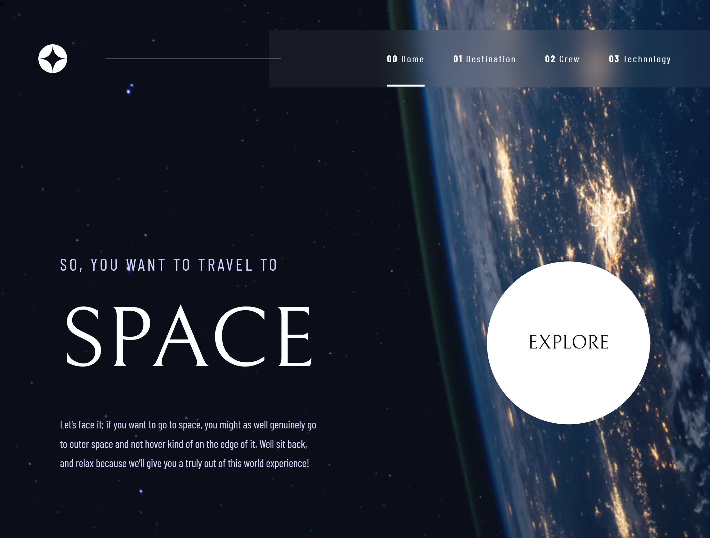

# Frontend Mentor - Space tourism website solution

This is a solution to the [Space tourism website challenge on Frontend Mentor](https://www.frontendmentor.io/challenges/space-tourism-multipage-website-gRWj1URZ3). Frontend Mentor challenges help you improve your coding skills by building realistic projects. 

## Table of contents

- [Overview](#overview)
  - [The challenge](#the-challenge)
  - [Screenshot](#screenshot)
  - [Links](#links)
- [My process](#my-process)
  - [Built with](#built-with)
  - [What I learned](#what-i-learned)
  - [Continued development](#continued-development)
- [Acknowledgments](#acknowledgments)

## Overview

### The challenge

Users should be able to:

- View the optimal layout for each of the website's pages depending on their device's screen size
- See hover states for all interactive elements on the page
- View each page and be able to toggle between the tabs to see new information

### Screenshot

### Links

- Solution URL: [My solution](https://github.com/Fender60/Space-Tourism.git)
- Live Site URL: [Live site](https://fender60.github.io/Space-Tourism/)

## My process

### Built with

- Semantic HTML5 markup
- Methodology BEM
- CSS custom properties
- SCSS
- Flexbox
- CSS Grid
- JS

### What I learned

I gained more experience in analyzing layouts to better write page markup and styles. I also gained skills in working with adaptive layout for different devices. It was very useful to work with fetch requests to get data, processing them and writing asynchronous functions. I learned how to dynamically change content on the page and worked a bit on my own slider.

### Continued development

In the future, I want to focus on building more dynamic sites using different frameworks and preprocessors that can speed up my development.

## Acknowledgments

I am grateful to Fronted Mentor for providing various interesting assignments and layouts for pumping up my skils, with which I can practice and learn.
